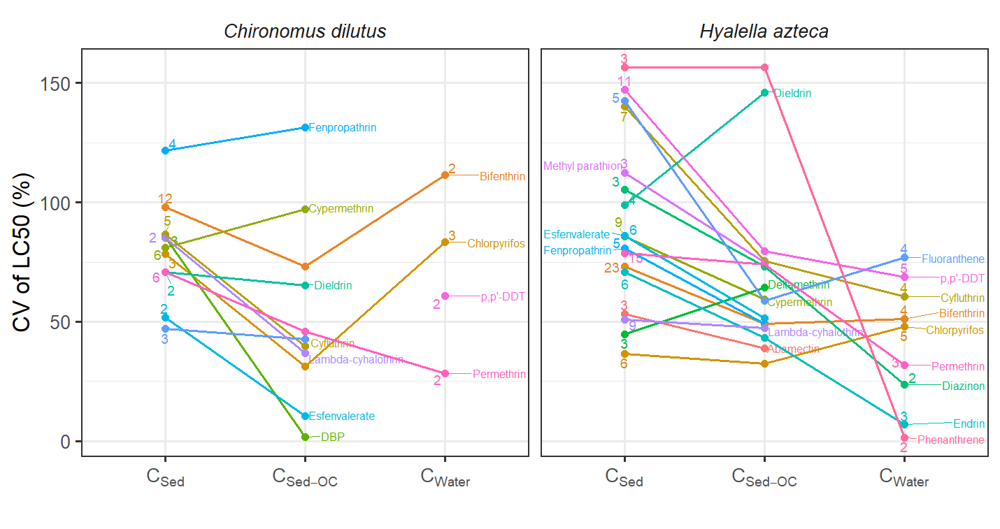
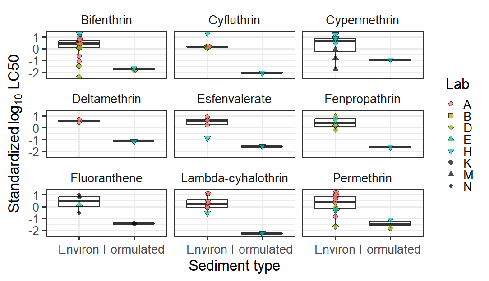

``` r 
### 1: Install and load the necessary packages ###
install.packages("openxlsx")
install.packages("tidyverse")
install.packages("ggplot2")
install.packages("MuMIn")
install.packages("ggbeeswarm")
install.packages("ggrepel")
install.packages("lme4")

library(openxlsx)
library(tidyverse)
library(ggplot2)
library(MuMIn)
library(ggbeeswarm)
library(ggrepel)
library(lme4)

#### 2: Import the dataset ####
Sed <- read.xlsx("Metaanalysis_dataset.xlsx",sheet="SpikeSediment") %>%
   filter(SedimentMeasured=="Yes")
Water <- read.xlsx("Metaanalysis_dataset.xlsx",sheet="WaterOnly")

dim(Sed) # confirm the data dimension
dim(Water) 

``` 

[1] 158  25
[1] 45 24

``` r
#### 3: Show the distribution of sediment toxicity values (Fig. S1) ####
FigS1 <- Sed %>% 
  mutate(SedType=ifelse(is.na(SedType), "not available", SedType)) %>%
  ggplot(aes(x=Chemical, y=log10(OCNorm_ug_gOC), fill=SedType, shape=SedType))+
  geom_beeswarm(size=3,alpha=0.8) +
  facet_wrap(~Species,ncol=1) +
  theme_bw(base_size=23) +
  theme(axis.text.x = element_text(angle = 45,hjust = 1),
        strip.text = element_text(face="italic"),
        strip.background =element_blank() )+
  scale_shape_manual(values = c(21,22,23)) +
  ylab(expression(paste(paste(log[10]," LC50 based on "), C[Sed-OC]))) +
  labs(shape="Sediment types", fill="Sediment types")
FigS1
```
<!-- -->
``` r
#### 4: Compare the CVs between three different concentrations (Fig. 1) ####
Sed2 <- Sed %>% 
  mutate (Concentration=ifelse(.$Concentration<=0,.$"OCNorm_ug_gOC" * .$"TOC" * 0.01 ,
                               .$Concentration)) %>%
  mutate (Concentration=ifelse(.$ConcUnits=="ug/kg",.$"Concentration" *  0.001 , .$Concentration)) 

Sed_variation <- Sed2 %>%
  mutate_at (vars(Concentration), as.numeric) %>%
  group_by(Species,Chemical) %>%
  summarize(SD_total = sd(Concentration), SD_norm=sd(OCNorm_ug_gOC),
            CV_total = sd(Concentration,na.rm=TRUE)/mean(Concentration,na.rm=TRUE)*100,
            CV_norm = sd(OCNorm_ug_gOC)/mean(OCNorm_ug_gOC)*100,
            Count_total = length(Concentration[!is.na(Concentration)]),
            Count_norm = length(OCNorm_ug_gOC[!is.na(OCNorm_ug_gOC)]))

Water_variation <- Water %>% 
  mutate_at (vars(Concentration),as.numeric) %>%
  group_by(Species,Chemical) %>%
  summarize(SD_water = sd(Concentration),
            CV_water = sd(Concentration,na.rm=TRUE)/mean(Concentration,na.rm=TRUE) *100,
            Count_water =length(Concentration) )

Variation_comp <- merge(Sed_variation, Water_variation) %>%
  dplyr::select (-c(SD_total,SD_norm,SD_water)) %>%
  filter(! is.na(CV_water) )

Fig1 <- Variation_comp %>%
  pivot_longer(cols=starts_with("CV"), names_to="Types",
               names_pattern = "CV_(.*)", values_to="CV") %>%
  pivot_longer( cols=starts_with("Count"), names_to="Types_count",
                names_pattern = "Count_(.*)",values_to="Count") %>%
  mutate(Types = ifelse(Types=="norm","Norm Sed",
                        ifelse(Types=="total", "Total Sed", "Water"))) %>%
  mutate(Types_count = ifelse(Types_count=="norm","Norm Sed",
                              ifelse(Types_count=="total","Total Sed","Water"))) %>%
  mutate(Types =factor(Types,levels=c("Total Sed","Norm Sed","Water")) ) %>%
  filter(Types==Types_count) %>% 
  mutate(SpeciesChemical=paste(Species,Chemical)) %>%
  mutate (Label=ifelse(Types=="Water",Chemical,"") ) %>%
  ggplot(aes(x=Types, y=CV, group=SpeciesChemical, col=Chemical))+
  geom_text_repel(aes(label=Label), nudge_x = 5,size=6)+
  geom_text_repel(aes(label=Count),size=5,position = position_nudge(y = 0.15))+
  geom_point(size=3.5)+geom_line(aes(lty=Species),size=1.3) +
  scale_linetype_manual(values = c("longdash","solid"))+
  theme_bw(base_size = 25) +
  theme(legend.position="none")+
  ylab("CV of LC50 (%)") + xlab("")+
  scale_x_discrete(breaks=c("Total Sed", "Norm Sed", "Water",""),
                   labels=c(expression(paste(C[Sed])),
                            expression(paste(C[Sed-OC])),expression(paste(C[Water]))) )
Fig1
```
<!-- -->
``` r
#### 5: Check the difference in toxicity values between sediment types (Fig. 2) ####
Sed2 <- Sed %>% 
  mutate (Concentration=ifelse(.$Concentration<=0,
                               .$"OCNorm_ug_gOC" * .$"TOC" * 0.01 ,.$Concentration)) %>%
  mutate (Concentration=ifelse(.$ConcUnits=="ug/kg",
                               .$"Concentration" *  0.001 ,.$Concentration)) %>%
  mutate ( SedToWater_Ratio_volume = ifelse(is.na(SedToWater_Ratio_volume),
                                            SedToWater_Ratio_wet_weight * 1.5,
                                            SedToWater_Ratio_volume)) %>% 
  # density is assumed to 1.5 g/mL
  mutate ( SedToTotalWater_Ratio = ifelse(Daily_Exchange_ratio=="0",
                                          as.numeric(SedToWater_Ratio_volume),
                                          as.numeric(SedToWater_Ratio_volume) / 
                                            (as.numeric(Daily_Exchange_ratio)*10) ) )

all <- Sed2 %>%
  group_by(Species, Chemical) %>%
  mutate (Deviation = (log10(OCNorm_ug_gOC) -mean(log10(OCNorm_ug_gOC) ) )/
            sd(log10(OCNorm_ug_gOC) ) ) %>%  #standardization
  mutate_at(vars(Aging_days), as.numeric) %>% 
  filter(!is.na (Deviation))

all %>%
  filter(Species=="Hyalella azteca") %>%
  filter(! is.na(SedType)) %>%
  filter(Chemical=="Bifenthrin" | Chemical=="Cyfluthrin" | Chemical=="Cypermethrin" |
           Chemical=="Deltamethrin" | Chemical=="Fenpropathrin" | Chemical=="Esfenvalerate" |
           Chemical=="Fluoranthene" |Chemical=="Lambda-cyhalothrin" | Chemical=="Permethrin") %>%
  mutate(SedType = ifelse(SedType=="environmental","Environ","Formulated")) %>%
  ggplot(aes(x=SedType,y=Deviation) ) +
  geom_boxplot(lwd=1,outlier.shape = NA) +
  facet_wrap(~Chemical) +
  geom_beeswarm(aes(fill=Lab,shape=Lab),
                alpha=0.7,size=3.5, stat = "identity", groupOnX = TRUE) +
  theme_bw(base_size=25) + 
  theme (strip.background= element_blank() ) +
  xlab("Sediment types") +
  scale_shape_manual(values = c(21:25,16,17,18)) +
  ylab(expression(paste("Standardized ",paste(log[10]," LC50"))))
```
<!-- -->
``` r
#### 6: Model selection (Table. 1) ####
all_model <- all %>%
  ungroup(Chemical,Species) %>% 
  filter(!is.na(OCNorm_ug_gOC) & !is.na(SedToTotalWater_Ratio) & !is.na(Aging_days) &
           !is.na(Renewal) & !is.na(SpikeMethod_detailed) & !is.na(Food) ) %>%
  mutate(SedToTotalWater_Ratio = scale(log10(SedToTotalWater_Ratio)) ) %>%
  mutate(Aging_days=scale(log10(Aging_days)) ) %>% 
  mutate(TOC = scale(TOC) ) %>%
  mutate(OrganicSource=ifelse(is.na(OrganicSource), "Environ", OrganicSource) )

full_all <- lmer ( log10(OCNorm_ug_gOC) ~ Chemical + Species + SedType + Renewal + SpikeMethod_detailed + SedToTotalWater_Ratio + Aging_days + Food + (1|Lab)  , all_model ) 

# model selection
options(na.action = "na.fail")
Res_all <- dredge(full_all,rank="AICc")
get.models(Res_all, subset = delta <=2)
```
